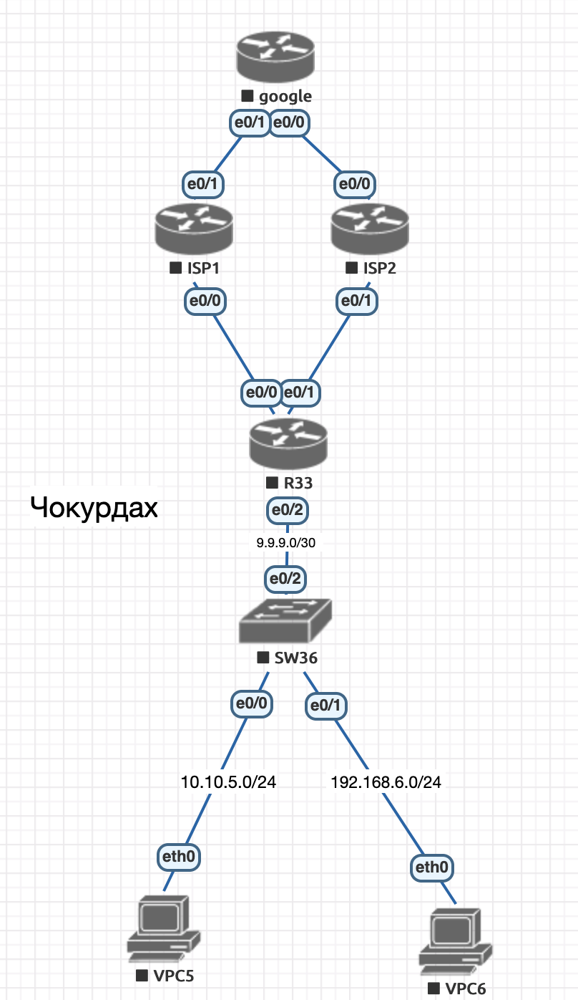

Cхема лабораторного стенда, выполненная в eve-ng:

#  IPv4

###  Задание:

 1. Настроите политику маршрутизации для сетей офиса.
 2. Распределите трафик между двумя линками с провайдером.
 3. Настроите отслеживание линка через технологию IP SLA.(только для IPv4).
 4. Настройте для офиса Лабытнанги маршрут по-умолчанию.
 5. План работы и изменения зафиксированы в документации.

 ####  Результат:

    В ходе выполнения работы, при обращение на ip 8.8.8.8 (google) из сети 10.0.0.0/8 трафик идёт через ISP1 (1.1.1.1), со всех остальных через ISP2(2.2.2.1)

    VPCS> tracet 8.8.8.8
Bad command: "tracet 8.8.8.8". Use ? for help.

VPCS> trace 8.8.8.8
trace to 8.8.8.8, 8 hops max, press Ctrl+C to stop
 1   10.10.5.1   15.925 ms  6.095 ms  5.858 ms
 2   9.9.9.1   7.545 ms  4.492 ms  2.986 ms
 3   1.1.1.1   4.816 ms  4.147 ms  4.154 ms

 VPCS> ping 8.8.8.8

84 bytes from 8.8.8.8 icmp_seq=1 ttl=252 time=4.023 ms
84 bytes from 8.8.8.8 icmp_seq=2 ttl=252 time=3.946 ms

VPCS> ping 8.8.8.8

84 bytes from 8.8.8.8 icmp_seq=1 ttl=252 time=4.239 ms
84 bytes from 8.8.8.8 icmp_seq=2 ttl=252 time=20.204 ms
84 bytes from 8.8.8.8 icmp_seq=3 ttl=252 time=4.141 ms
84 bytes from 8.8.8.8 icmp_seq=4 ttl=252 time=16.930 ms
84 bytes from 8.8.8.8 icmp_seq=5 ttl=252 time=18.234 ms

VPCS> trace 8.8.8.8
trace to 8.8.8.8, 8 hops max, press Ctrl+C to stop
 1   192.168.6.1   9.275 ms  6.507 ms  4.901 ms
 2   9.9.9.1   11.654 ms  6.132 ms  4.914 ms
 3   2.2.2.1   4.562 ms  4.342 ms  3.905 ms