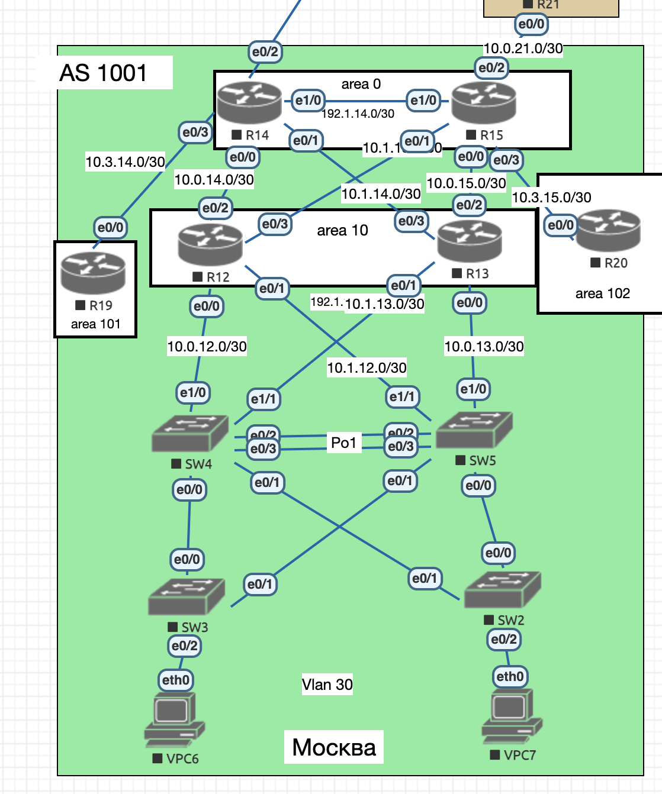

# Схема лабораторного стенда, выполненная в EVE-NG

---

## Цель работы

1. Настроить OSPF в офисе «Москва».
2. Разделить сеть на зоны.
3. Настроить фильтрацию маршрутов между зонами.

---

## Задание

1. Маршрутизаторы **R14–R15** находятся в зоне **0 (backbone)**.
2. Маршрутизаторы **R12–R13** находятся в зоне **10** и дополнительно к маршрутам должны получать маршрут по умолчанию.
3. Маршрутизатор **R19** находится в зоне **101** и получает только маршрут по умолчанию.
4. Маршрутизатор **R20** находится в зоне **102** и получает все маршруты, кроме маршрутов до сетей зоны 101.
5. План работы и все изменения зафиксированы в документации.

---

## Результат выполнения

- **R14** и **R15** выступают в роли **ABR (Area Border Router)**, так как их интерфейсы подключены к разным зонам OSPF.

- **R12** и **R13** находятся в зоне **10**, настроенной как **stub area**, что позволяет им получать:
  - все внутрисетевые маршруты;
  - межзонные маршруты;
  - маршрут по умолчанию для выхода к внешним сетям.

- **R19** находится в зоне **101**, настроенной как **totally stub area**, поэтому получает:
  - внутрисетевые маршруты;
  - только маршрут по умолчанию **0.0.0.0/0**.

- **R20** расположен в обычной зоне **102**.  
  На ABR **R15** настроен **prefix-list** для фильтрации маршрутов, поступающих из зоны 101, что исключает передачу сетей зоны 101 в зону 102.

---

## Вывод

В ходе работы была реализована многоуровневая архитектура OSPF с разделением на зоны различного типа (backbone, stub, totally stub и normal area).  
Настроена межзонная фильтрация маршрутов, обеспечивающая оптимизацию таблиц маршрутизации и контроль распространения сетевых префиксов.
